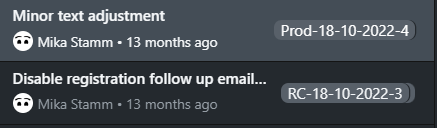

# GitHub Actions Workflow Documentation

## Overview

This GitHub Actions workflow is designed to automate the build and deployment processes for a .NET application. 

It is set up to deploy to either staging and production environments and triggered by tags:

**Staging**: Tags starting with `RC-` (Release candidate) will automatically build and deploy that commit to the configured Staging server in debug mode.

**Production**: Tags starting with `PROD-` will consequently be deployed to the Production server. 

This makes keeping track of deployment history and versions a convenient pleasure in you git history.




## Workflow Variables
Modify the environment variables in the workflow file for your project:
```
env:
  DOTNET_VERSION: '6.0.x'
  REMOTE_DEPLOYMENT_PATH: '/var/www/my-api' 
  PROJECT_NAME: 'MyApi'
  STAGING_HOST: 'staging.myservice.example'
  STAGING_SSH_USER: 'deployer'
  PROD_SSH_HOST: 'prod.myservice.example'
  STAGING_SSH_USER: 'deployer'
  SERVICE_NAME: 'my-api'

```
You also have to set up these two secrets in your repository's settings. They should contain private keys to authenticate the respective users

* `STAGING_SSH_PRIVATE_KEY`
* `PRODUCTION_SSH_PRIVATE_KEY`

## Assumptions
* Stage & Prod servers use systemd services to run. Restarting the service specified in SERVICE_NAME restarts your application after the update
* Your csproj file lives in <Reponame>/<PROJECT_NAME>
* REMOTE_DEPLOYMENT_PATH is the same for Staging and Production environments

